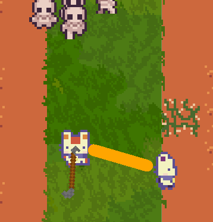
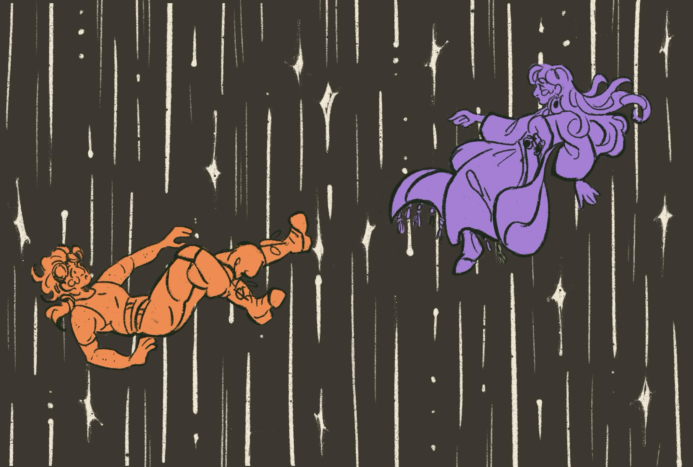
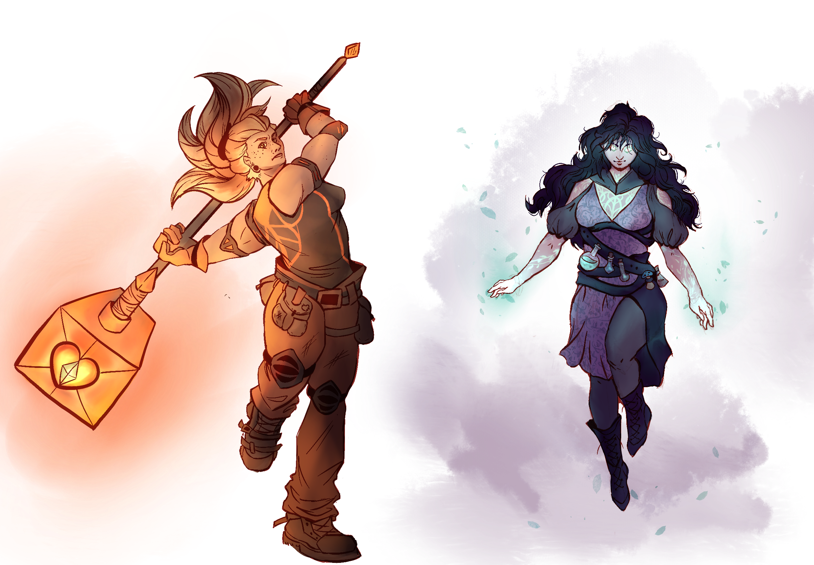

Bringing friends back to the couch with a co-op roguelite where every run is fresh, fair, and finished together.  
Couch coop is arguably one of the most important genres of gaming for strengthening bonds between friends. Giving people things to do while they're together and actively hanging out. Unfortunately the idea of two people getting together regularly enough to enjoy a game as story driven as the likes of Portal becomes laughable as you leave childhood. Roguelites fix this by allowing you and your friends to pick up a session whenever without feeling obligated to continue through finishing the whole game.  
Most roguelites however don't really market towards this genre, focusing mostly on singleplayer aspects, and many of the ones that *do* have a multiplayer feature leave it notably barebones in comparison to whatever singleplayer they have.  
As such, we've decided to create a roguelite where the multiplayer feel is foremost in development. With features that prioritize enjoyment of the multiplayer experience while avoiding making anything that's particularly impossible to rebalance for singleplayer, we've created a game that is designed to be played together with friends as a refresher when hanging out.  
  

### How to run and play

Currently the source code is available on our here github page and the game can be launched and played via godot.

## Tech Stack
The game itself was developed using Godot's 2d game engine. We primarly utilized aesprite for editing and creating art assets within the game. Enemy AI was made using LimboAI.

# Credits

## Design Team
Griffin Stober  
Kabir Vidyarthi  
Ryan Shepard  
Zachary Etterson
## Art Team
Gabrielle Sterbank  
Emily Brown
Lana ???
Sophia Annikin
## Story Team
Bella La Boy  
Duncan Paris
